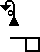

# SignWriting Transcription

This project aims to automatically transcribe SignWriting from isolated/continuous sign language videos.

### Examples

(These examples are taken from the DSGS Vokabeltrainer)

|             |                        00004                        |                        00007                        |                        00015                        |
|:-----------:|:---------------------------------------------------:|:---------------------------------------------------:|:---------------------------------------------------:|
|    Video    |  |  |  |
| SignWriting |   |   |   |

## Usage
```
git clone https://github.com/sign-language-processing/signwriting-transcription.git
cd signwriting-transcription
pip install .[dev,pose_to_signwriting]
cd ..
```
To translate pose file to signwriting fsw format
```
pose_to_signwriting --model="{model_number}.ckpt" --pose="example.pose" --elan="example.eaf"
```

## Tokenization

SignWriting can be tokenized using
the [SignWriting Tokenizer](https://github.com/sign-language-processing/signbank-plus/blob/main/signbank_plus/signwriting/signwriting_tokenizer.py).

## Data

For this study, there are two notable lexicons, containing isolated sign language videos with SignWriting
transcriptions.

- [Sign2MINT](https://sign2mint.de/) is a lexicon of German Signed Language (DGS) focusing on natural science subjects.
  It features 5,263 videos with SignWriting transcriptions.
- [SignSuisse](https://signsuisse.sgb-fss.ch/) is a Swiss Signed Languages Lexicon that covers Swiss-German Sign Language (DSGS), 
  French Sign Language (LSF), and Italian Sign Language (LIS). The lexicon includes approximately 4,500 LSF videos
  with [SignWriting transcriptions in SignBank](https://www.signbank.org/signpuddle2.0/index.php?ui=4&sgn=49).

(can also add around 2300 videos from the Vokabeltrainer)

## License

This project is licensed under the MIT License.
